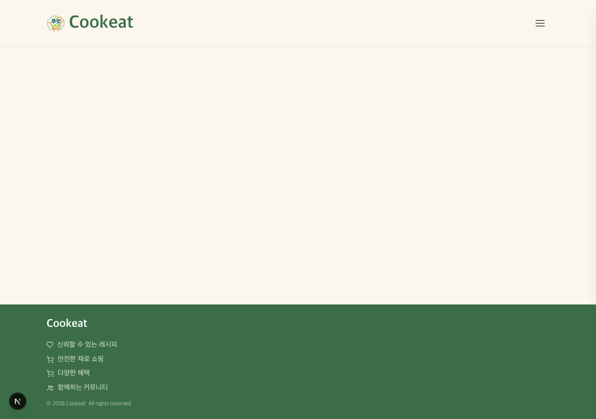
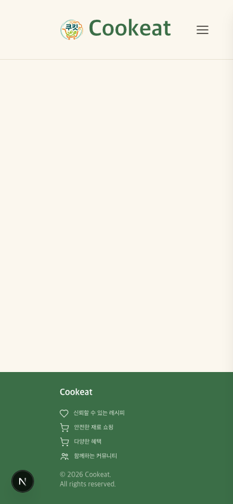
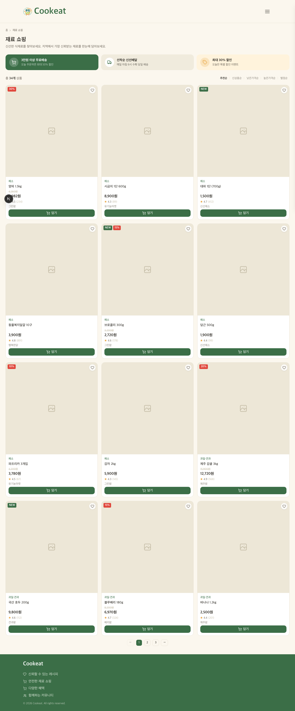
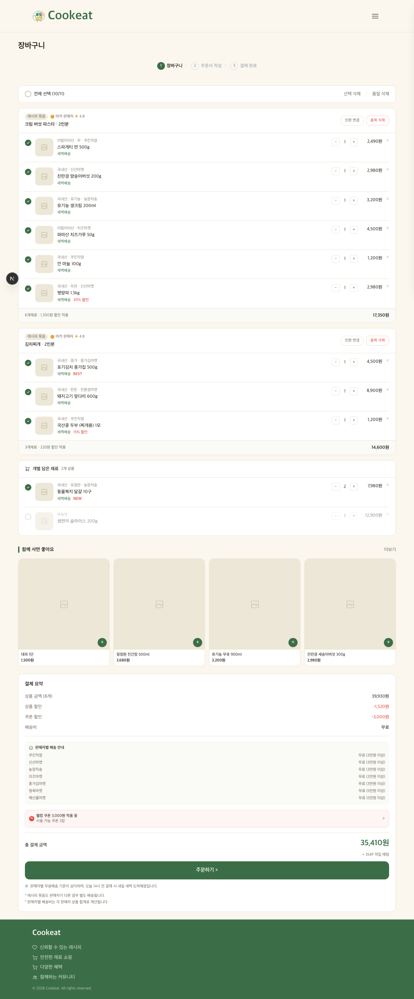
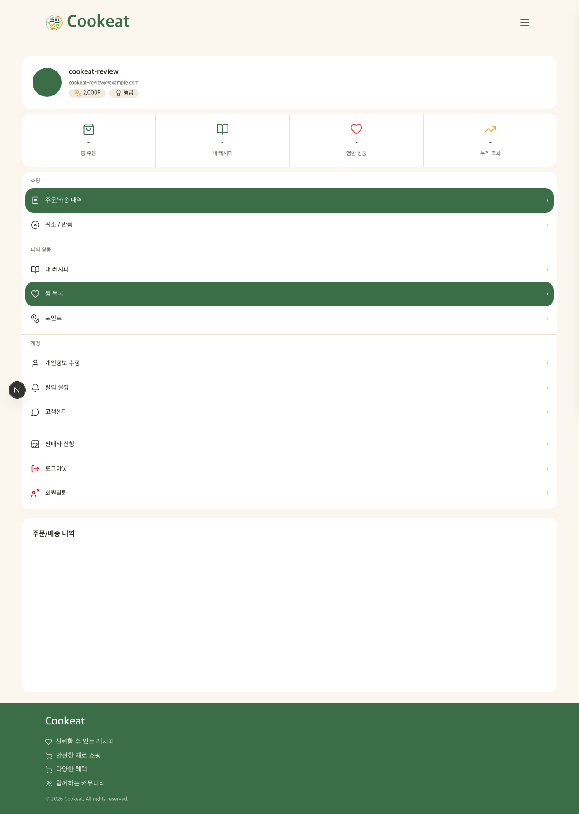
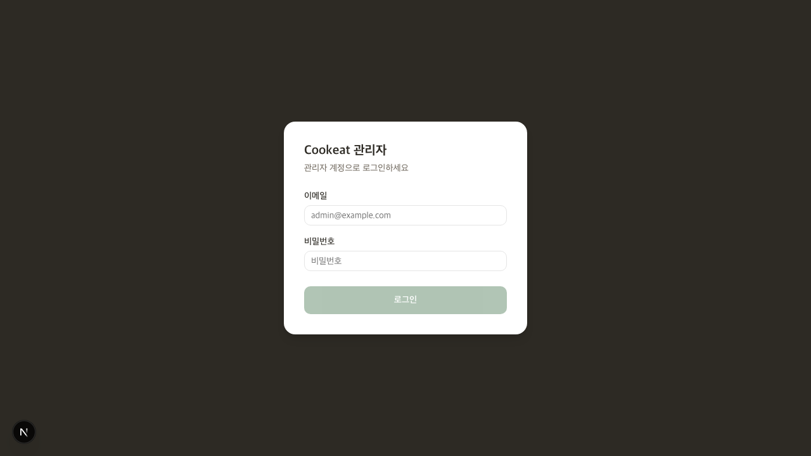
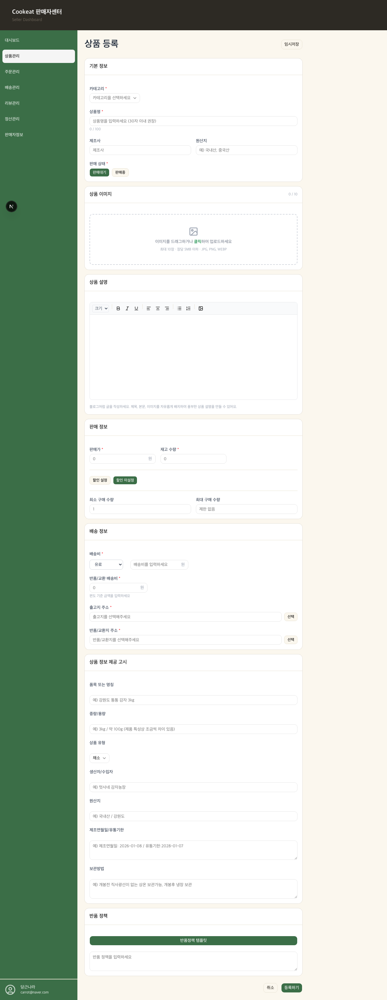

# Cookeat 6차 코드 리뷰 (2026-06-16)

범위: 5차 리뷰 이후 develop 44커밋(`4e0d38a..HEAD`). 빌드 복구·CI 빌드 게이트, 결제 금액 서버 재계산·주문 영속화, 어드민 회원관리 실데이터 연동, 공통 StatusBadge·Pagination 통합, 비어드민 차단, 재료 쇼핑 페이지(목업), README 현행화.

이번엔 빌드가 풀려서 앱을 실제로 띄워 E2E를 돌렸습니다. 정적 검증(`tsc`)도 함께 봤습니다.

작성자 분포(merge 제외): **엄인호(djsy01) 19 · 최유종(jjong0) 10 · 추유나(nana9147)**. urstory 1건은 머지 커밋입니다. 세 분 다 움직이고 있습니다.

---

## 1. 지난 리뷰(5차) [필수]·[제안] 반영 현황

| 지난 지적 | 상태 | 근거 |
| --- | --- | --- |
| [필수] ① 빌드 복구(`useKakaoPostcode`) | ✅ **해결** | `tsc --noEmit` 클린(0건). `fbe973c` 전역 타입 수정 |
| [필수] ④ CI 빌드 게이트 | ✅ **해결** | `.github/workflows/ci.yml` 신설(`4ba5542`). develop PR에서 `tsc --noEmit` + `build` 실행 |
| [필수] ③ 결제 금액 서버 재계산 | ✅ **해결** | `app/api/order/route.ts` 주문 영속화 + `payment/toss/confirm/route.ts:20` 서버 금액 대조 |
| [필수] ③ 주문 확정 단계 | ✅ **해결** | confirm/approve에서 `status: '결제완료'` 업데이트(`route.ts:38`) |
| [제안] 공통 컴포넌트 끌어올리기 | ✅ **해결** | `components/common/StatusBadge.tsx`·`components/ui/Pagination.tsx` 신설, admin 10개 페이지가 공통 import |
| [필수] ② 셀러 화면 가드 | ❌ **미해결**(3라운드째) | `app/seller/layout.tsx`에 가드 없음. E2E로 비로그인 폼 열림 실측 |

다섯 가지가 정리됐습니다. 빌드·CI·결제 세 축이 한 번에 풀렸으니 큰 진전입니다. 남은 건 셀러 가드 하나인데, 4·5차에 이어 세 번째라 이번엔 우선순위로 둡니다.

---

## 2. [칭찬] 결제 — 금액이 드디어 서버 손으로 넘어왔습니다

5차에서 "누가 결제하는지는 서버가 알지만, 얼마를 결제하는지는 아직 클라이언트 손"이라고 했었습니다. 이번에 그 구멍이 닫혔습니다. 흐름을 따라가 보면 이렇게 됩니다.

먼저 주문을 DB에 만듭니다.

```ts
// app/api/order/route.ts:5-37
const authed = await requireAuth(req);
if (authed instanceof NextResponse) return authed;
// ...
const { data: order } = await supabaseAdmin
  .from('orders')
  .insert({ order_id: orderId, user_id: authed.userId, final_amount: finalAmount, status: '결제전', ... })
  .select('order_id, final_amount').single();
return NextResponse.json({ orderId: order.order_id, finalAmount: order.final_amount });
```

그리고 결제 확정 때 **서버가 그 주문에서 금액을 다시 읽어 대조**합니다.

```ts
// app/api/payment/toss/confirm/route.ts:13-22
const { data: order } = await supabaseAdmin
  .from('orders').select('final_amount, user_id, status').eq('order_id', orderId).single();

if (order.user_id !== authed.userId) return new NextResponse('Forbidden', { status: 403 }); // 소유권
if (order.status === '결제완료') return NextResponse.json({ status: 'DONE' });             // 멱등성
if (order.final_amount !== amount) return NextResponse.json({ error: '결제 금액이 일치하지 않습니다.' }, { status: 400 });
// 토스 confirm에는 클라가 보낸 amount가 아니라 order.final_amount를 보냄
body: JSON.stringify({ paymentKey, orderId, amount: order.final_amount }),
```

세 가지를 한 번에 막았습니다. 다른 사람 주문을 확정하지 못하게(소유권), 중복 결제를 막고(멱등성), 클라가 보낸 금액이 주문과 다르면 거절합니다(위조 방지). 토스 confirm에 넘기는 금액도 클라 값이 아니라 DB의 `order.final_amount`입니다. 카카오 approve도 같은 식으로 소유권·멱등성을 막고 있고요(`kakao/approve/route.ts:14-22`). 5차에 짚은 패턴을 그대로 코드로 옮겼습니다. 강하게 칭찬하고 싶네요.

한 가지만 다음 숙제로 남겨 둡니다.[제안] `/api/order`가 주문을 만들 때 `finalAmount`를 **클라이언트가 보낸 값 그대로** 신뢰합니다(`route.ts:9`). 즉 "주문 금액"의 진짜 기준점이 아직 클라에 있습니다. 사용자가 주문 생성 시점에 `finalAmount`를 50,000원으로 보내면 그 값이 그대로 주문이 되고, 이후 confirm은 그 잘못된 주문과 일치하니 통과합니다. 다음 단계는 **주문 생성 때 서버가 장바구니 품목·가격·수량을 DB에서 읽어 합계를 직접 계산**하는 것입니다(클라는 품목 id만 보내고). 지금 구조가 이미 그쪽으로 갈 준비가 돼 있어서, 합계 계산 한 군데만 서버로 옮기면 됩니다. 해결 흐름은 가이드 2번에 적었습니다.

---

## 3. [필수] 셀러 화면 가드 — admin은 닫혔는데 seller는 아직 열려 있습니다

admin은 이번에도 잘 막혀 있습니다. 비로그인·일반회원 모두 차단됩니다(E2E C6c·C6e 통과). 가드가 이렇게 들어가 있죠.

```tsx
// app/admin/layout.tsx:17-19
return (
  <AdminAuthGuard>   {/* 로그인+role==='admin' 확인 후에만 children 렌더 */}
    ...
```

`AdminAuthGuard`는 `_hydrated` 대기 → 토큰 없으면 로그인으로, role이 admin이 아니면 alert 후 홈으로 보냅니다(`AdminAuthGuard.tsx:14-25`). 정확합니다.

문제는 **셀러는 같은 가드가 없다**는 점입니다.

```tsx
// app/seller/layout.tsx:6-19  ← 가드 없이 바로 children 렌더
export default function SellerLayout({ children }: { children: React.ReactNode }) {
  return (
    <>
      <Header />
      ...
      <main className="flex flex-1 flex-col">{children}</main>
```

그래서 **비로그인 상태로 `/seller/products/new`에 바로 들어가면 상품 등록 폼이 통째로 열립니다.** 코드만 본 게 아니라 실제로 띄워서 확인했습니다(아래 E2E 결과 C6d 캡처). admin과 seller 둘 다 "운영자만 보는 화면"인데 한쪽만 닫혀 있는 건 불균형이라 생각합니다.

이미 `AdminAuthGuard`라는 모범 답안을 직접 만들어 두셨으니, 같은 형태로 `SellerAuthGuard`(role 체크를 `seller`로) 하나 만들어 `seller/layout.tsx`를 감싸면 끝납니다. 가이드 1번에 admin 가드를 본뜬 예시를 적었습니다. 4·5차에 이어 세 번째라, 혹시 셀러 권한 모델(누구를 seller로 볼지)이 아직 안 정해져서 미뤄 둔 건가요? 그렇다면 그 결정부터 짧게 맞추고 가는 게 좋겠습니다.

---

## 4. 멤버별

### 엄인호 (@djsy01) — 19커밋
이번 회차의 무게중심입니다. 빌드 복구(`fbe973c`)·CI 게이트(`4ba5542`)·결제 금액 서버 재계산(`5c4b407`)·주문 확정(`9c29d15`)·배송지 DB 저장(`773d64b`)까지, 5차에 [필수]로 남았던 항목 대부분을 직접 닫았습니다. 특히 `order/route.ts → confirm/route.ts`로 이어지는 주문-결제 분리가 깔끔합니다. 주문을 먼저 만들고 확정 때 서버가 그 주문을 기준으로 검증하는 흐름은 실서비스 결제에서 쓰는 방식이고요. 남은 한 걸음은 2장에 적은 "주문 생성 시 서버측 합계 계산"입니다.

### 최유종 (@jjong0) — 10커밋
어드민을 계속 책임지고 있습니다. 회원관리 실데이터 연동(`9817af8`)으로 mock을 걷어내고 `app/api/admin/users/route.ts`·`status/route.ts`를 추가했습니다. 5차에 "대시보드까지만 실데이터"라 했는데 members가 따라온 거라 좋습니다. 그리고 인라인 badge를 공통 `StatusBadge`로 통합한 리팩터(`ea0d228`)도 본인 영역이었습니다 — admin 10개 페이지가 전부 `@/components/common/StatusBadge`를 import하게 바뀌었고, 페이지마다 흩어져 있던 `gradeBadge`/`statusBadge` 리터럴이 사라졌습니다. 5차에 짚은 "배지 두 벌" 문제를 직접 푼 거라 칭찬합니다. 다음은 orders/products/sellers의 남은 mock을 members에서 만든 패턴으로 옮기는 것입니다.[제안]

### 추유나 (@nana9147)
재료 쇼핑 페이지(`a631ef6`)를 새로 올렸습니다. `app/(main)/shopping/` 아래 필터(카테고리·가격·판매자)·정렬·페이지네이션·평점/배지까지 완성도가 높습니다. 특히 새 페이지에서도 공통 `@/components/ui/Pagination`을 가져다 쓴 게 좋습니다(`ShoppingClient.tsx:10`) — 자기 자산을 남도 쓰게 만들던 5차의 감각이 이번엔 "남의 공통 자산을 내가 쓰는" 쪽으로도 작동한 셈입니다. 데이터는 아직 `mockProducts`(`data/mockProducts.ts`)인데, 타입(`types/ingredient.ts`)을 미리 잘 끊어 둬서 실 DB로 갈 때 교체 지점이 명확합니다. 다음은 이 목업을 상품 테이블 실데이터로 잇는 것이라 생각합니다.[제안]

---

## 5. 팀이 "한 사람처럼" 가고 있나 — 협업 진단

5차에서 "인프라는 한 사람처럼, UI·표현 계층은 아직 따로(StatusBadge 두 벌·공통 훅이 seller 사일로 안에만)"라고 판정했었습니다. **이번에 그 표현 계층의 사일로가 눈에 띄게 줄었습니다.**

**합쳐진 증거.**
- **`StatusBadge`가 한 벌로 모였습니다.** `components/common/StatusBadge.tsx`가 상품·주문·배송지·회원 등급/상태·판매자·정산·콘텐츠·문의까지 한 스타일맵으로 통합됐고, **admin 10개 페이지가 전부 이걸 import**합니다(`products/page.tsx:15` 외 9곳). 5차에 "색 한 번 바꾸려면 두 곳을 고쳐야 한다"던 문제가 정리됐습니다.
- **`Pagination`이 영역을 가로질러 공유됩니다.** `components/ui/Pagination.tsx`를 seller(`ProductTable`·`OrderTable`·`ShippingTable`)·admin(`members/page.tsx`)·main(`shopping`) 다섯 곳이 같이 씁니다. 영역 셋이 같은 컴포넌트를 쓰는 첫 사례라, "한 사람처럼"의 분명한 신호라 생각합니다.
- 비어드민 접근 차단(`e29b7a3`)도 admin 영역의 가드를 끝까지 채운 거라 좋습니다.

**아직 남은 것.**
- seller는 여전히 자기 타입형 `app/seller/components/StatusBadge.tsx`를 따로 씁니다. admin은 공통으로 옮겼는데 seller는 그대로라, 결국 배지가 두 벌인 상태는 절반만 풀렸습니다. seller 것도 공통으로 합치면 완전히 한 벌이 됩니다.[제안] (다만 seller 쪽은 union 타입으로 더 안전하니, 공통 컴포넌트를 제네릭/유니온으로 받게 다듬는 방향이 더 좋습니다.)
- 셀러 가드 부재(3장)는 협업 관점에서도 "같은 종류 화면을 둘이 다르게 처리"한 흔적입니다. admin 가드를 본떠 seller에도 같게 닫으면 두 영역의 처리가 일치합니다.

토대(serverAuth·axios·authStore)에 이어 **표현 계층까지 공통 자산이 자리 잡기 시작했습니다.** 5차에 드린 처방이 코드로 돌아온 회차입니다. 남은 두 가지(seller 배지·seller 가드)만 정리하면 진짜 한 손에서 나온 코드가 됩니다.

---

## 6. 실측 결과

- **tsc**: `npx tsc --noEmit` → **0건(클린)**. 5차의 `useKakaoPostcode.ts:7` TS2687이 사라졌습니다. 빌드 다섯 번째 빨간불을 끝냈습니다.
- **CI 게이트**: `.github/workflows/ci.yml`이 develop PR에서 `tsc --noEmit` + `npm run build`를 돌립니다. 이제 빌드 깨진 채 머지되는 패턴은 구조적으로 막힙니다.
- **RLS(anon publishable 키)**: `GET /rest/v1/users`·`GET /rest/v1/orders` → 둘 다 `[]`. 민감 테이블 anon 노출 없음(보안 자세 유지, 칭찬).
- **결제 시크릿**: 서버 라우트 전용, 클라 노출 없음 — 유지.

---

## 7. E2E 결과 (2026-06-16)

빌드가 풀려서 이번엔 앱을 실제로 띄워 시나리오를 돌렸습니다. 시나리오는 `review/e2e/scenarios.md`, 스펙은 `review/e2e/tests/cookeat-daily.spec.ts`입니다. 로그인은 이메일 계정(`review/e2e/test-account.md`)으로 했고, 실제 Supabase 세션이 생성됩니다.

| 시나리오 | 결과 | 비고 |
| --- | --- | --- |
| C1 메인 진입(desktop/mobile) | 통과(진입) | Header+Footer만 보이고 본문이 비어 있음 |
| C2 재료 쇼핑 목록·필터 | 통과 | 그리드+필터/정렬/페이지네이션/배지/평점 완성도 높음 |
| C3 장바구니 | 통과 | 합계 35,410원 정상 |
| C4 이메일 로그인 | 통과 | 실제 Supabase 세션 생성 |
| C5 마이페이지 | 통과 | 계정정보(포인트·등급) 정상 |
| C6c/C6e admin 가드(비로그인·일반회원) | 통과(차단) | 둘 다 막힘 |
| **C6d seller `/seller/products/new` 비로그인** | **실패(폼 열림)** | **셀러 가드 부재 — 3장 [필수]** |

**[제안] 메인 본문이 비어 있습니다.** `app/(main)/page.tsx`가 `return <main className="flex-1" />;` 한 줄이라, 화면에 Header와 Footer만 보입니다(C1 캡처). 첫인상이 빈 화면이라 아쉽습니다. 추천 레시피나 인기 상품 섹션을 곧 채우면 좋겠습니다.










---

## 8. 다음(7차) 대조용 우선순위

1. **[필수] 셀러 화면 가드** — `app/seller/layout.tsx`에 `AdminAuthGuard`를 본뜬 `SellerAuthGuard`(role==='seller') 적용
2. **[제안] 주문 생성 시 서버측 합계 계산** — `/api/order`가 클라 `finalAmount`를 신뢰하지 않고 장바구니 품목을 DB에서 읽어 합계 산출
3. **[제안] 메인 본문 채우기** — `app/(main)/page.tsx` 빈 화면 채우기
4. **[제안] seller `StatusBadge` 공통으로 합치기** — admin처럼 `components/common`으로 일원화(공통을 유니온 안전하게 다듬으며)
5. **[제안] admin orders/products/sellers mock → 실 DB** — members 패턴 복제
