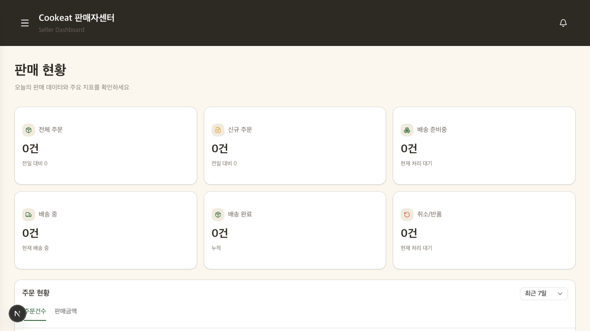
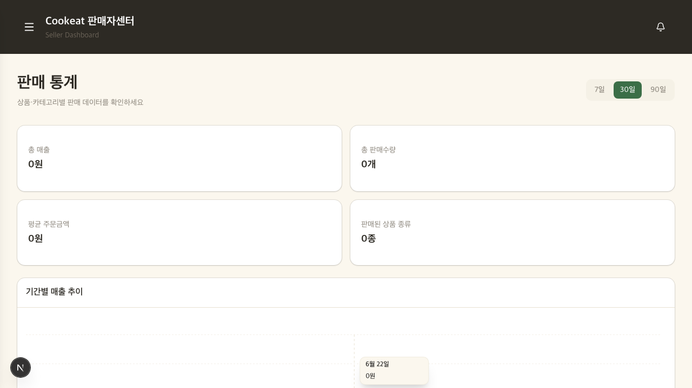
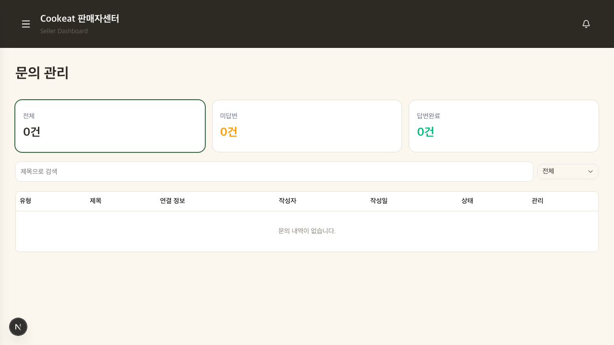

# Cookeat 20차 코드 리뷰 (2026-07-07)

발표를 하루 앞둔 실개발 마지막 날 리뷰입니다. 지난 19차(2026-07-06) 이후 develop에 쌓인 38개 커밋을 대상으로,
새로 붙은 판매자 대시보드·통계·문의관리와 1:1 문의 시스템을 중심으로 봤습니다.

먼저 결론부터 적자면, 이번 회차도 **새로 고쳐야 할 `[필수]`는 없습니다.** 지난 회차에서 유일하게 남겨 뒀던
`[제안]`(레시피 수정 비원자성)도 깔끔하게 정리됐고, 신규로 들어온 판매자 기능들의 인증·인가·검증이
지금까지 이 조가 쌓아 온 수준 그대로 탄탄하게 붙어 있어 마무리 단계로서 아주 좋은 상태라 생각합니다.

---

## 1. 지난 리뷰(19차) 반영 현황

| 지난 지적 | 등급 | 상태 |
| --- | --- | --- |
| updateRecipe 비원자성(delete→insert 사이 실패 시 스텝/재료 손실) | [제안] | **해결** — `update_recipe_tx` RPC로 원자화(bc2105f) |
| eslint 42 → CI 게이트 없음 | [제안] | 부분 — 39 → 39건, 여전히 CI 미게이트. 신규 문의 컴포넌트에서 error 4건 유입 |
| 데모 썸네일 플레이스홀더 교체 | [제안] | 부분 — 발표 전 마무리 항목으로 아래 팀 공통에 다시 정리 |
| 통계 집계 쿼리(신규/재구매 전건 2회 스캔) | [제안] | **해결** — `get_seller_customer_first_orders` RPC로 전환(6ae6bf9) |

레시피 수정 원자성부터 보겠습니다. 지난 회차에 `updateRecipe`가 본문 업데이트 → 조리순서 delete+insert →
재료 delete+insert 를 순차로 나눠 처리하다가 중간에 하나라도 실패하면 조리순서나 재료가 0개로 남을 수 있다고
짚었는데, 이번에 `app/api/recipes/db.ts`에서 세 갱신을 `update_recipe_tx` RPC 하나로 묶어(bc2105f) DB 트랜잭션
안에서 처리하도록 바꿨습니다. 이렇게 하면 중간 실패 시 delete까지 전부 롤백되니 "재료가 통째로 날아간 레시피"가
생길 여지가 사라졌고, 커밋 메시지에도 그 의도를 정확히 적어 뒀습니다. 지적한 그대로, 이유까지 이해하고
고친 게 보여서 좋았습니다.

---

## 2. E2E 결과 (2026-07-07, dev :3200)

`review/e2e/tests/cookeat-daily.spec.ts`를 이번 신규 엔드포인트 기준으로 갱신해, 일반 사용자 여정과
판매자 여정을 순서대로 돌렸습니다. 판매자 화면은 리뷰 전용 계정을 임시로 seller 승격(+seller 행 생성)해 확인한 뒤
전부 원복했습니다. 7개 시나리오 모두 통과입니다.

| 시나리오 | 결과 | 비고 |
| --- | --- | --- |
| U01 홈 | pass | `title=Cookeat`, 렌더 정상 |
| U02 레시피 목록 → 상세 | pass | 목록 렌더·상세 이동 정상 |
| U04 상품 목록 → 상세 | pass | `/shopping/9` 상세 진입 |
| S01 판매자 대시보드 — 비로그인 가드 | pass | `/seller` → `/login?next=%2Fseller` 리다이렉트 |
| S02 판매자 대시보드(로그인) | pass | 판매금액 탭 추가 확인 (아래 캡처) |
| S03 판매 통계(신규) | pass | 7/30/90일 토글·매출 추이 차트 렌더 |
| S04 셀러 문의관리(신규) | pass | 전체/미답변/답변완료 카드·검색·필터 렌더 |

판매자 대시보드는 "주문건수 / 판매금액" 탭이 새로 붙었고 기간(최근 7일/30일)은 별도 드롭다운으로 분리돼,
지난번에 두 토글이 겹쳐 보이던 문제가 정리된 게 화면에서 확인됩니다.

**보안 실측(anon 키 직접 조회):** 신규 테이블을 포함해 민감 테이블 전부가 익명 접근으로는 0행/차단이었습니다.
`inquiries`·`inquiry_replies`·`inquiry_images` 모두 anon으로 0행, `coupons`는 401(42501),
`sellers`·`users`·`orders`·`order_items`·`refund_requests`·`settlements`도 전부 0행. 문의 시스템이 새로 들어오면서
테이블이 3개 늘었는데 RLS를 빠짐없이 채워 회귀가 없다는 점이 확인됐습니다.

**정적 검증:** `tsc --noEmit` 학생 소스 0건, `npm run build` 성공(정상 프리렌더). eslint는 39건(error 4·warning 35).
참고로 제 로컬에서 처음 `tsc`가 `@tiptap/extension-color`·`extension-highlight`를 못 찾는다고 났는데,
확인해 보니 `package-lock.json`에는 두 패키지가 정상적으로 들어 있고 제 쪽 `node_modules`만 오래돼 있던 것이라
`npm ci` 후 깨끗하게 통과했습니다. 학생 코드 문제가 아니니 안심하셔도 됩니다.

---

## 3. 조원별 리뷰

이번 delta의 작성자는 git author 기준으로 엄인호(djsy01) 12·추유나(nana9147) 11·최유종(jjong0) 9 커밋으로,
결제/문의 백엔드는 엄인호, 판매자 화면·통계·상품폼은 추유나, 관리자·정산·검색은 최유종으로 도메인이 뚜렷합니다.

### 엄인호(@djsy01)

1:1 문의 시스템의 백엔드와 주문 취소/환불 로직을 맡았는데, 검증과 인가를 촘촘히 짜 둔 게 이번에도 돋보였습니다.

- **[잘함] 1:1 문의 생성(`app/api/inquiries/route.ts`)의 입력 검증이 정석입니다.** 카테고리 화이트리스트,
  제목·내용 필수, 이미지 개수 5개 제한과 `storageBase.startsWith` URL 검증, product/order 동시 지정 차단까지
  갖춰 뒀고, 특히 주문 상품 문의일 때 `order_items → orders.user_id`를 조회해 **본인 주문이 아니면 404로 막는**
  소유권 검증(:104)을 넣은 게 좋습니다. 상품 문의는 `SELLER_CATEGORIES`, 일반 문의는 `GENERAL_CATEGORIES`로
  카테고리와 연결 대상의 정합성까지 맞춰 둔 부분은, 클라이언트가 카테고리를 조작해도 서버에서 걸러지니 든든합니다.
- **[잘함] 상품 문의 공개 게시판(`products/[productId]/inquiries/route.ts`)의 닉네임 마스킹.** 목록을 공개로 노출하되
  작성자 본인이 아니면 `maskNickname`으로 가리고(:63), 응답에 `user_id`를 담지 않은 것도 잘 챙겼습니다.
- **[잘함] 취소/환불 신청 공용화(`lib/orderClaims.ts`).** cancel과 refund가 인증·조회·중복확인·기록 로직이 같아
  `createOrderClaim` 하나로 묶었고, `shipping_status` 기준으로 신청 가능 항목을 거른 뒤 구매확정·진행중 신청을
  제외하고, 마지막에 `refund_requests`의 unique 제약 위반(23505)을 잡아 더블클릭 동시 신청까지 409로 막습니다(:110).
  왜 `orders.status`가 아니라 `order_items.shipping_status`를 봐야 하는지 주석으로 근거를 남긴 것도 좋았습니다.
- **[잘함] 정지 계정 로그인 차단(`auth/login/route.ts:22`).** 로그인 성공 후 `users.status === 'suspended'`면
  `admin.signOut` 하고 403으로 되돌립니다. 세션이 클라이언트로 넘어가기 전에 끊으니 흐름도 안전합니다.
- **[사소] 로그인 라우트의 `await req.json()`(:7)에 try/catch가 없습니다.** 깨진 바디로 호출되면 400 대신 500이
  납니다. 지난 회차에도 결제 라우트에서 비슷하게 짚었던 부분이라, 여유 되면 `catch(() => null)` 한 줄로
  400 처리해 두면 응답이 깔끔해집니다. 발표를 막는 문제는 아니니 우선순위는 낮습니다.
- **[제안] `inquiries` 생성 후 `inquiry_images` insert(:132)가 에러 확인 없이 뒤따릅니다.** 이미지 insert가
  실패해도 문의 본문은 이미 저장돼 "사진 없이 등록된 문의"가 조용히 생길 수 있습니다. 이미지가 부차적이라
  큰 문제는 아니지만, 실패 시 로그를 남기거나 응답에 표시해 두면 나중에 원인 추적이 쉬워집니다.

### 추유나(@nana9147)

판매자 대시보드·통계·문의관리 화면과 상품 등록/수정 폼을 맡았습니다. 판매자 포털이 이번에 크게 두꺼워졌는데
인가를 `requireSellerContext`로 일관되게 통과시킨 점이 인상적입니다.

- **[잘함] 셀러 문의관리 답변 라우트(`seller/inquiries/[inquiryId]/reply/route.ts`)의 소유권 검증.**
  답변을 달기 전에 `verifyOwnership`으로 그 문의가 **본인이 판매한 상품/주문에 연결된 것인지**를
  `products.seller_id` 또는 `order_items.seller_id`로 확인하고(:27), 아니면 403으로 막습니다. 관리자는 조회만
  가능하도록 method가 GET이 아니면 되돌리고, 이미 답변이 있으면 409, 수정(PATCH)은 답변 작성자 본인인지까지
  확인합니다. 남의 상품 문의에 답변을 끼워 넣을 경로가 안 보여서 좋았습니다.
- **[잘함] 통계 신규/재구매 집계를 RPC로(`seller/statistics/db.ts:206`).** 지난번에 전건 2회 스캔이라 짚었던 부분을
  `get_seller_customer_first_orders` RPC로 옮겨, 고객별 첫 주문 시각만 받아와 기간 시작 이전이면 재구매로
  판정합니다. 취소/환불을 `shipping_status` 기준으로 일관되게 제외한 것도 대시보드와 기준이 맞습니다.
- **[잘함] 대시보드 판매금액 그래프(`seller/dashboard/db.ts:122`).** 주문건수만 보이던 그래프에 판매금액을
  더하면서, 날짜별로 `order_id`를 Set으로 모아 건수를 세고 `quantity * unit_price`로 금액을 합산해 두 지표를
  같은 데이터에서 뽑아냅니다. 탭/기간 토글 분리까지 UX가 정리됐습니다.
- **[제안] 신규 문의관리 컴포넌트에서 eslint error 4건이 새로 생겼습니다.** `app/seller/inquiries/page.tsx:54,90,94`와
  `app/seller/components/Inquiry/InquiryReplyModal.tsx:36`이 전부 `react-hooks/set-state-in-effect`
  (effect 안에서 setState를 동기로 호출)입니다. 동작에는 지장이 없어 빌드는 통과하지만, 데이터를 불러와
  상태에 넣는 패턴이라면 effect 안에서 곧바로 `setState`하기보다 로딩 상태를 나눠 두는 편이 리렌더 낭비를
  줄여 줍니다. 해결 가이드에 패턴을 적어 뒀습니다.

### 최유종(@jjong0)

관리자 고객센터 개편과 정산·검색 안정화를 맡았습니다. 이 조의 강점인 관리자 API 인가를 이번에도 지켜냈습니다.

- **[잘함] 관리자 검색 keyword 이스케이프 완결(`bd46ba9`).** 지금까지 `[제안]`으로 여러 회차 이월돼 온
  PostgREST `.or()` 필터 인젝션을, `escapeOrValue` 헬퍼를 만들어 admin의 products·users·orders·sellers
  네 라우트에 **빠짐없이** 적용했습니다. 쉼표·괄호가 든 검색어로 필터를 깨거나 탈출시키던 경로가 이걸로 닫혔습니다.
  오래 끌던 항목을 한 번에 정리해 준 게 좋습니다.
- **[잘함] 정산 100건 상한 제거·SQL 집계 전환(`6795019`)과 취소/환불 제외 기준 통일(`eeae00e`).** VIP 판정과
  대시보드 카테고리 매출이 취소·환불 건을 서로 다르게 세던 것을 하나의 기준으로 맞춘 건, 화면마다 숫자가
  어긋나 보이는 걸 막아 주는 좋은 정리입니다.
- **[잘함] 사용자 문의를 `faqs` 테이블 기반으로 재편(`99b6ca7`, `207bda1`, `b43c719`).** 관리자 고객센터를
  레시피/쿠폰/계정 문의 전용 화면으로 나누고, 답변 조회/등록 API를 티켓 구조로 전환했습니다.
- 이번 delta는 관리자·정산 쪽 안정화가 중심이라 새로 짚을 `[필수]`/`[제안]`은 없습니다. 도메인이 셋으로
  자연스럽게 나뉘어 있는데, 혹시 팀에서 상의해 관리자 영역을 최유종 님이 전담하기로 한 것인지, 아니면
  자연스럽게 그렇게 된 건지 궁금합니다. 발표에서 각자 기여를 설명할 때 참고가 될 것 같습니다.

---

## 4. 팀 공통

- **[잘함] 인가 계층이 흔들리지 않습니다.** 판매자 API가 대거 늘었는데도 전부 `requireSellerContext`(admin 대리
  조회는 GET+`sellerId` 존재 검증) 뒤에 두고, 문의 답변처럼 소유권이 걸린 동작은 별도로 seller_id를 대조합니다.
  전 API가 `supabaseAdmin`(RLS 우회)으로 도는 구조라 라우트 가드가 곧 보안인데, 그 가드를 빠짐없이 채우는
  습관이 이 조의 가장 큰 자산이라 생각합니다.
- **[제안] eslint를 CI 게이트로.** 지금 error 4건이 빌드를 막지 않다 보니 신규 코드에서 슬금슬금 늘어납니다.
  발표 후라도 `.github/workflows`의 CI에 `next lint`(또는 `eslint .`)를 한 스텝 추가해 두면, 이런 게 머지 전에
  걸러집니다. 당장은 위 4건만 정리해도 39 → 35로 떨어집니다.
- **[제안] 발표 전 마무리 두 가지.** 하나는 홈 데모 썸네일이 아직 플레이스홀더로 보이는 자리가 남아 있는지
  한 번만 훑어 실제 이미지로 교체해 두는 것(채용 담당자가 링크를 눌렀을 때의 첫인상), 다른 하나는 18차에
  짚었던 README의 clone URL이 개인 fork(`djsy01/Cookeat`)로 돼 있던 부분이 조직 저장소로 정정됐는지
  확인하는 것입니다. 코드가 아니라 "보이는 마무리"라 우선순위가 높진 않지만, 하루 남은 시점에 ROI가 큽니다.

---

## 총평

마무리 회차로서 아주 좋은 상태입니다. 새 `[필수]`가 없고, 지난 `[제안]`(레시피 수정 원자성)도 지적한 이유까지
이해하고 RPC로 정확히 고쳤으며, 이번에 새로 들어온 판매자 대시보드·통계·문의관리와 1:1 문의가 전부
인증·인가·검증을 갖춘 채로 붙었습니다. 남은 건 발표를 위한 "보이는 마무리"(데모 이미지·README)와 eslint
정리 정도라, 코드 자체는 발표에 그대로 내놓아도 손색이 없다고 봅니다. 마지막까지 수고 많으셨습니다.
